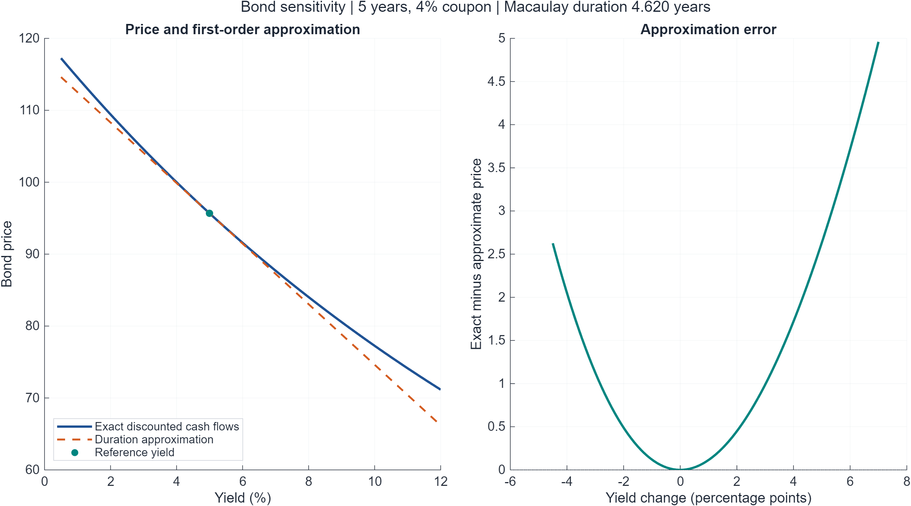
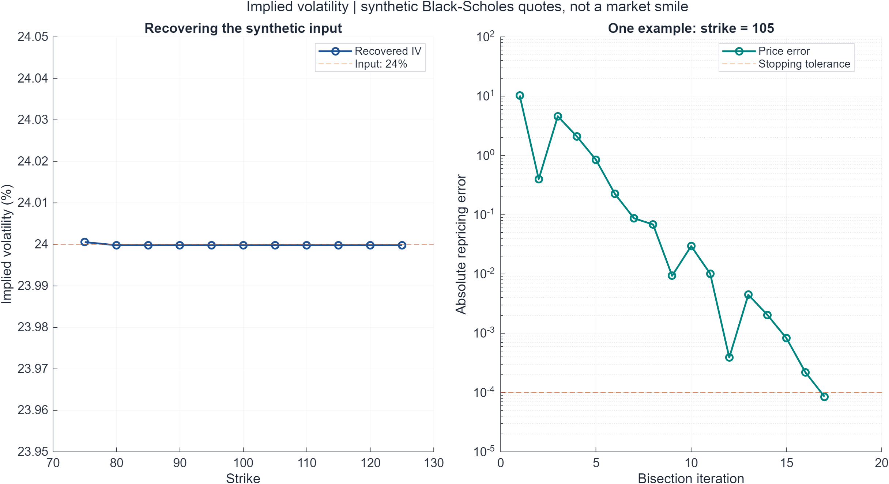
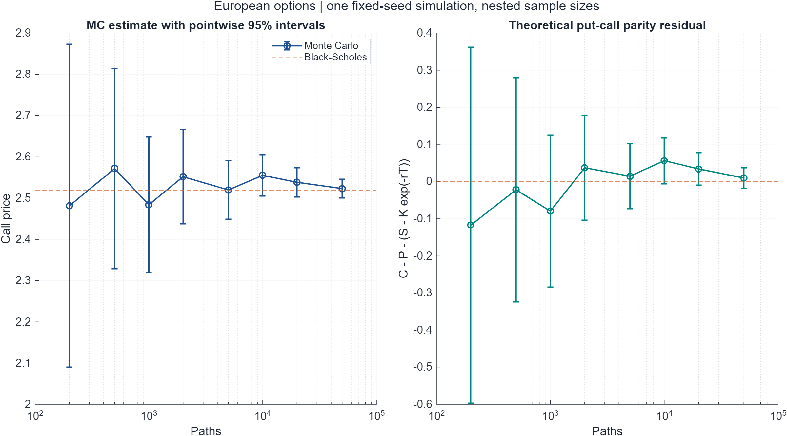
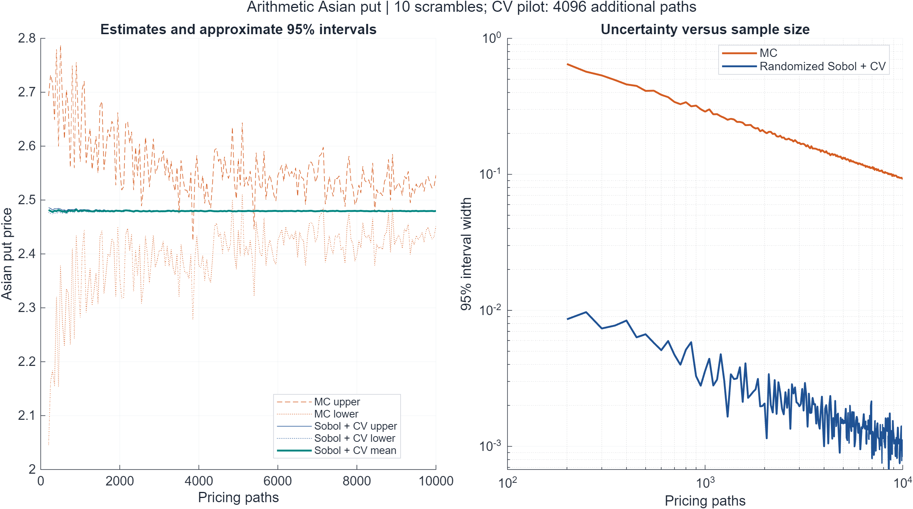
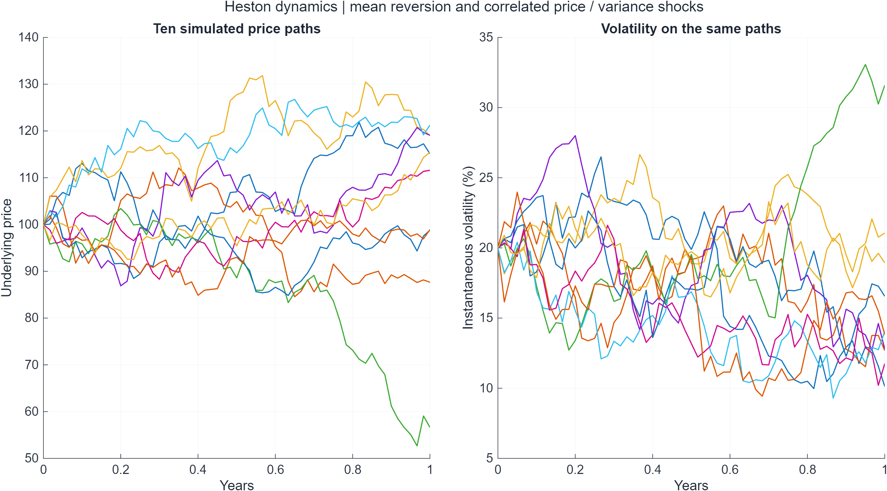
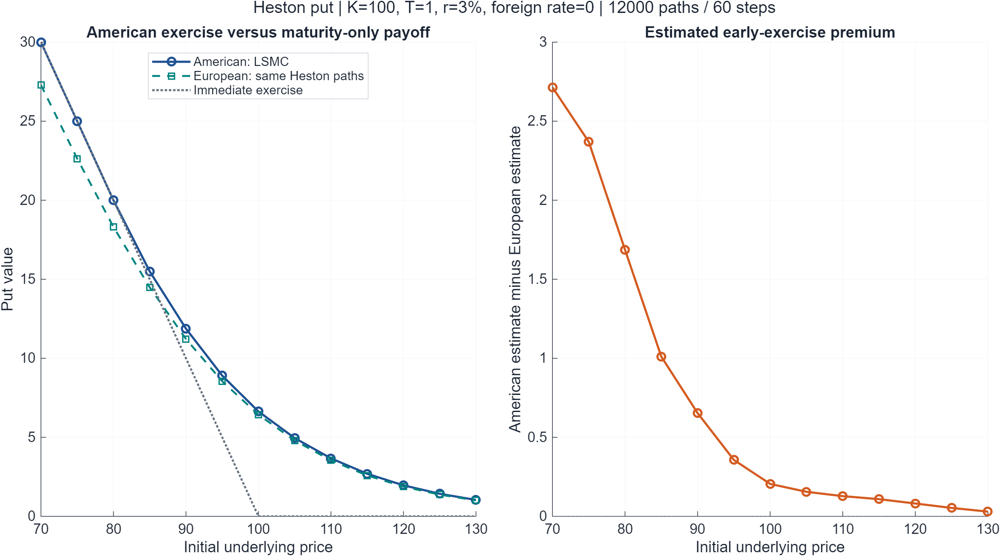
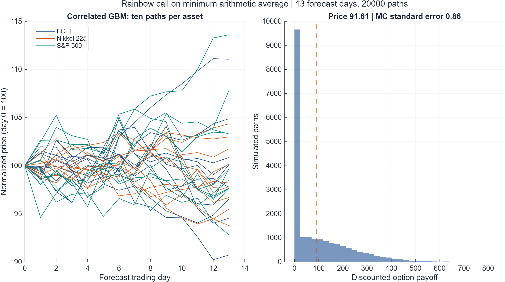
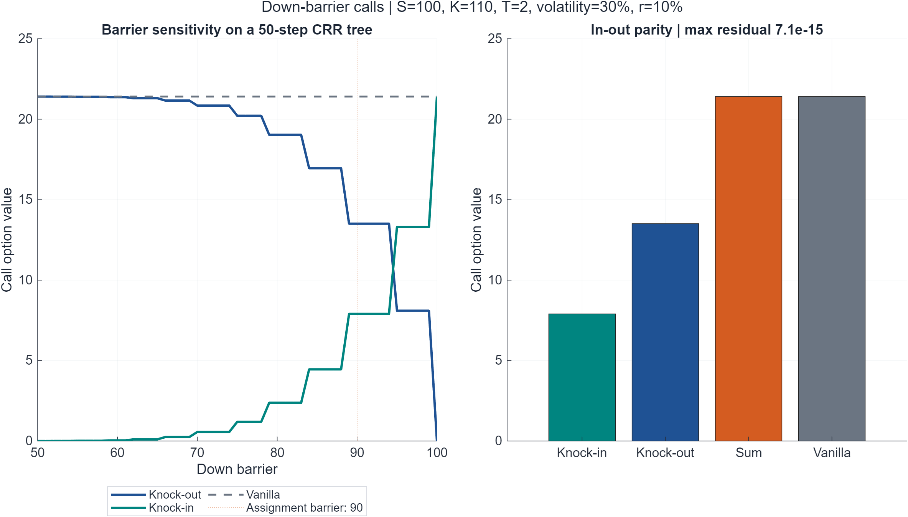

# 圖表總覽

所有圖表由 [`generate_figures.m`](generate_figures.m) 與 [`demonstrations/portfolio_figures.m`](demonstrations/portfolio_figures.m) 產生。

## HW7｜債券價格與存續期間

精確價格與存續期間一階近似的比較，呈現近似誤差隨利率變動擴大。

## HW8｜隱含波動率與二分法

由24%波動率產生合成報價，再反解波動率，並追蹤價格誤差。這是數值流程驗證，並非市場波動率微笑。

## HW9｜歐式選擇權Monte Carlo

與Black–Scholes基準比較，同時呈現理論Put–Call Parity的估計誤差及抽樣區間。

## HW10｜亞式選擇權估價與區間寬度

比較MC和randomized Sobol＋控制變量的估價及區間寬度；QMC額外使用4096條pilot路徑。

## HW11｜Heston價格與波動度路徑

顯示同一批路徑中的價格及波動度；波動度為變異數狀態的平方根。

## HW11｜美式賣權與提前履約價值

比較LSMC美式賣權、相同Heston路徑的歐式賣權及立即履約價值。模型設外國利率為0；價格差為有限樣本估計。

## HW12｜多資產彩虹選擇權

左圖是三指數的相關模擬路徑，右圖是最小算術平均買權的折現payoff分布。起始日只用於模擬，不納入13日平均。

## HW13｜障礙選擇權與In-Out Parity

比較不同下方障礙水準的knock-in及knock-out價格；階梯狀變化是50步離散CRR樹的特性。

